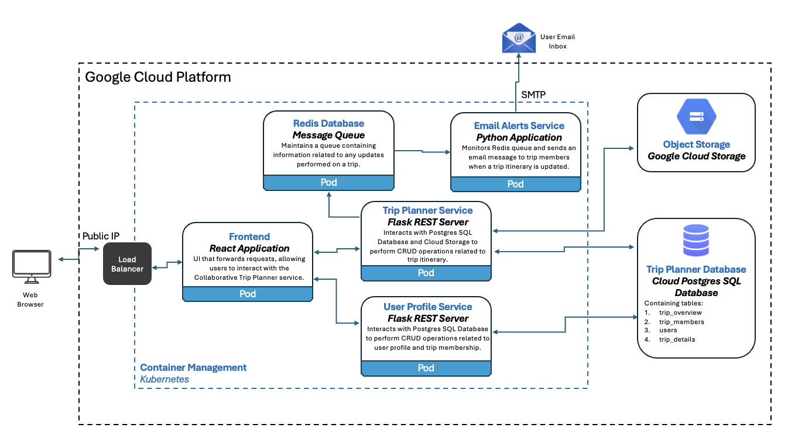
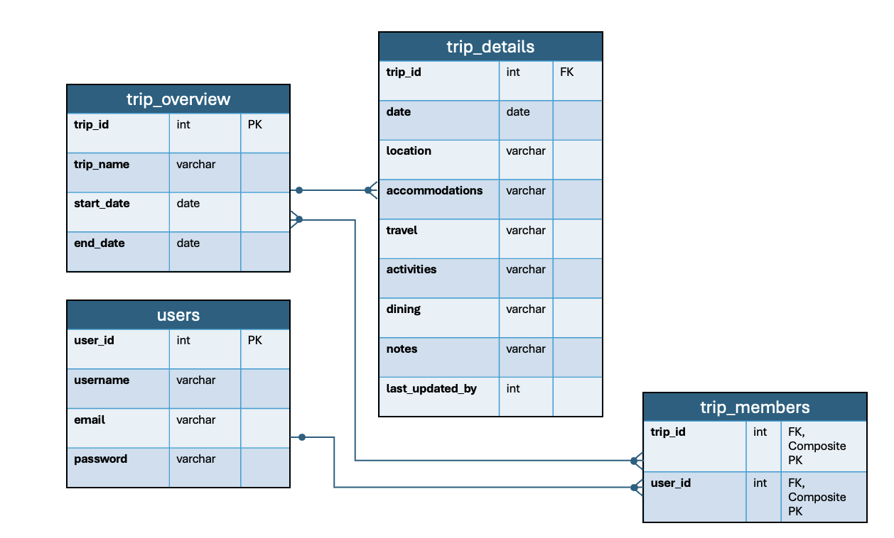

# Collaborative Trip Planner Service

## Description
The Collaborative Trip Planner Service is a collection of distributed components that enables users to more easily plan and share travel itineraries. The goal of this project was to create an environment where users within a trip group are able to share and collaborate on travel details including trip dates, locations, accommodations, and expected activities. Functionality includes the ability for a user to create a new trip, allowing this trip owner to add other users to the trip group, enabling all trip members to access and modify shared trip planning data, providing users with the ability to upload and download documents related to their trip (e.g. tickets or confirmation emails), and sending email notifications to all trip members when a user in the group updates the itinerary.

## Architecture

### Architecture Diagram




### Postgres SQL Database Schema



## Deployment to Kubernetes

The Collaborative Trip Planner is designed to be deployed via Kubernetes. The following sequence of terminal commands can be used to deploy all components as a Kubernetes pods:

```bash
kubectl apply -f redis/redis-deployment.yaml

kubectl apply -f redis/redis-service.yaml

kubectl apply -f user-profile/deployment.yaml

kubectl apply -f user-profile/service.yaml

kubectl apply -f trip-planner/deployment.yaml

kubectl apply -f trip-planner/service.yaml

kubectl apply -f messaging/deployment.yaml

kubectl apply -f frontend/deployment.yaml

kubectl apply -f frontend/service.yaml
```

For specific instructions on how to deploy and test each of the service's components (frontend, messaging, redis, trip-planner, user-profile), please reference the **README.md** files defined in each component's respective directory.
